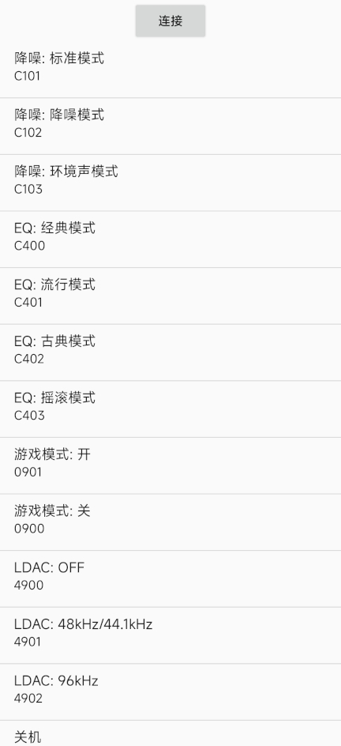
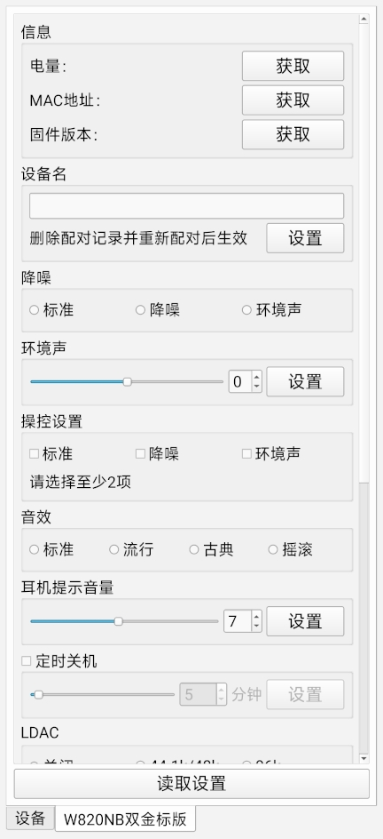
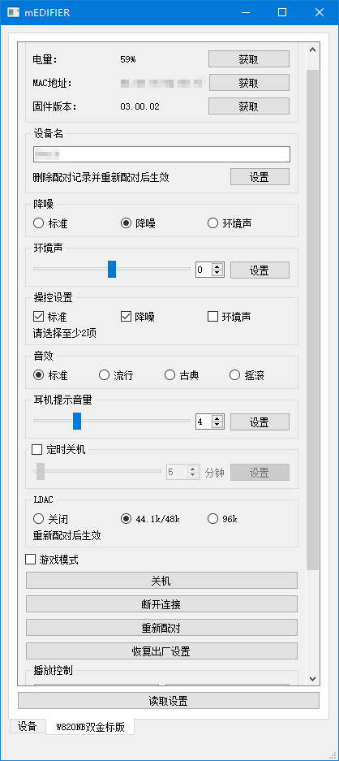

# mEDIFIER
I just don't know why the Edifier Connect takes up more than 200MB on my phone.  

# Pros
+ Smaller  
  (Android: ~2MB, Qt(Android): ~9MB, Qt(PC): ~30MB)  
+ No Internet is required  
+ Less click on the physical buttons  
+ Cross-platform  

# Cons
+ Tested on W820NB Double Gold and W200BT Plus only  
  (Maybe works for W820NB Plus and W820NB somehow)  
+ The BLE connection on Windows is not convenient  
+ Sending raw commands to your device might break it  

# Previews
(All versions have both English And Simplified Chinese interfaces)
| Android | Qt(Android) | Qt(PC) |  
| --- | --- | --- |  
|  |  |  |  

# Download
[GitHub Releases](https://github.com/wh201906/mEDIFIER/releases)
